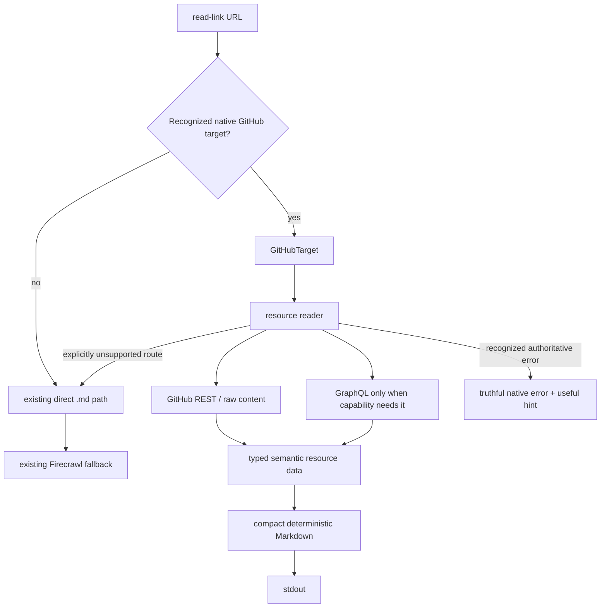

# GitHub-Native `read-link` Implementation Plan

## Planning Basis

- **Repository:** `amxv/webctx`
- **Checkout:** `/workspace/repos/webctx`
- **Approved branch:** `main`
- **Planning date:** 2026-08-14
- **Planning coordinate:** `4d11f46a39e8ccdbbeccd29c3107e1e801791aff`. This is provenance only; implementation agents must treat current remote code as truth.
- **Specification basis:** the complete product discussion leading to this plan, including the user's explicit approval of URL-scoped deterministic GitHub output, roughly 5,000-character repository README previews, frontmatter-style repository metadata, contextual GitHub URL hints, optional auth, no webctx caching, truthful pagination/completeness, and exclusion of GitHub security pages.
- **Workflow:** `existing-repo-feature-planning-workflow(2).md` from the user's Library.
- **Current-state research:** [`github-native-read-link-sweep-2026-08-14.md`](./github-native-read-link-sweep-2026-08-14.md).
- **No reference implementation:** none was supplied. The current `webctx` code and GitHub's first-party APIs are authoritative inputs.

### Authoritative external sources

Implementation must re-check current GitHub docs when provider behavior is unstable. The planning baseline used these primary sources:

- REST API versions: https://docs.github.com/en/rest/about-the-rest-api/api-versions
- REST authentication: https://docs.github.com/en/rest/authentication/authenticating-to-the-rest-api
- REST rate limits: https://docs.github.com/en/rest/using-the-rest-api/rate-limits-for-the-rest-api
- REST pagination: https://docs.github.com/en/rest/using-the-rest-api/using-pagination-in-the-rest-api
- REST best practices: https://docs.github.com/en/rest/using-the-rest-api/best-practices-for-using-the-rest-api
- Repository/contents APIs: https://docs.github.com/en/rest/repos
- Git references: https://docs.github.com/en/rest/git/refs
- Issues: https://docs.github.com/en/rest/issues
- Pull requests: https://docs.github.com/en/rest/pulls
- Commits: https://docs.github.com/en/rest/commits
- Actions: https://docs.github.com/en/rest/actions
- Checks: https://docs.github.com/en/rest/checks
- Releases: https://docs.github.com/en/rest/releases
- Activity and metrics: https://docs.github.com/en/rest/activity and https://docs.github.com/en/rest/metrics
- Deployments: https://docs.github.com/en/rest/deployments
- Search: https://docs.github.com/en/rest/search
- Users/organizations: https://docs.github.com/en/rest/users and https://docs.github.com/en/rest/orgs
- Packages: https://docs.github.com/en/rest/packages
- Gists: https://docs.github.com/en/rest/gists
- GraphQL auth: https://docs.github.com/en/graphql/guides/forming-calls-with-graphql
- GraphQL Discussions: https://docs.github.com/en/graphql/guides/using-the-graphql-api-for-discussions
- GraphQL review threads / blame / Projects v2: https://docs.github.com/en/graphql/reference/objects

### Execution protocol

- Pull/fetch safely before each implementation session and preserve newer remote work.
- Current source/tests/docs are truth; the planning SHA is not a checkout target.
- Implement phases in order. A later agent may continue across contiguous phases only after fully validating and recording each completed phase.
- Keep the branch usable at every phase boundary.
- Do not add a second permanent GitHub reader beside the first. Migration may temporarily coexist inside a phase, but each phase should end with one authoritative path for the URL families it owns.
- Update public docs when a phase changes user-visible `read-link` behavior.
- Use live public GitHub probes in addition to deterministic local tests for provider semantics that can safely be exercised.
- Do not write real tokens, private payloads, logs containing secrets, or private repository content into tests, docs, progress, or commits.
- If a load-bearing provider assumption is disproved, add an Amendment immediately rather than weakening an acceptance criterion.

## State of Current System

`webctx read-link <url>` currently has three sequential paths:

1. a small GitHub parser that recognizes repository roots and blob/tree URLs, using `raw.githubusercontent.com` for roots/blobs;
2. a generic direct-`.md` path;
3. Firecrawl `/v2/scrape` for everything else.

Most GitHub UI URLs—including Issues, Pull Requests, Actions, releases, profiles, lists, Discussions, and tree pages—therefore use Firecrawl. The current GitHub model contains only owner/repo/branch/path/is-file and ignores query/fragment semantics. The generic HTTP helper discards response headers, preventing `Link` pagination and structured rate-limit handling. GitHub auth is not loaded. There is only one simple GitHub parser unit test.

See the Sweep for exact functions, docs, live probes, API ceilings, and numbered landmines.

## State of Ideal System

### One semantic GitHub read path

`ReadLink` keeps its simple public command but gains one authoritative GitHub-native subsystem before the generic direct-Markdown/Firecrawl fallbacks:



A **recognized target** is not the same as “any `github.com` URL.” Native readers claim only route families they can faithfully represent. Unsupported GitHub routes retain the current generic fallback behavior.

### Cross-phase vocabulary

#### `GitHubTarget`

The canonical parsed meaning of a GitHub URL. It owns semantic identity, not provider response data. Across phases it must be able to represent:

- host (`github.com` or supported GitHub-owned host such as `gist.github.com`);
- owner/repository when applicable;
- resource kind and stable identity (issue/PR number, commit SHA, run/job ID, Gist ID, etc.);
- view/tab (`files`, `commits`, `checks`, list/search view, etc.);
- unresolved ref/path tail for source routes until provider-backed resolution;
- original query parameters relevant to the page/list;
- fragment selector (line range, heading, issue comment, review comment, review, diff file/line, etc.);
- original/canonical URL for rendering and hints.

This is a semantic contract. Phase-local helper names/fields remain implementation choices.

#### `GitHubClient`

The one provider boundary for GitHub REST/GraphQL requests. It owns:

- standard request headers and explicit REST API version;
- optional auth token selection;
- status + headers + body preservation;
- REST `Link` pagination;
- GitHub-specific error/rate-limit classification;
- GraphQL calls for capabilities REST cannot truthfully provide;
- no persistent response cache.

It should remain standard-library Go unless current repository evidence later establishes a compelling reason to add a dependency.

#### Native result state

The GitHub routing boundary must distinguish three outcomes:

1. **handled successfully** — return native Markdown;
2. **recognized but failed authoritatively** — return a truthful GitHub-specific error/hint, not Firecrawl;
3. **unsupported by the native reader** — continue through the existing generic direct-Markdown/Firecrawl pipeline.

This prevents private/rate-limited Issue URLs from silently becoming scraped login/error pages while preserving fallback for long-tail UI that has no native implementation.

### Output philosophy

The output is deterministic and URL-scoped. **Clean means removing representation noise, not summarizing content.**

- Preserve substantive human-visible author text, comments, review text, source, patches/logs when that direct URL asks for them, and meaningful state transitions.
- Remove API plumbing, avatars, node IDs, redundant links/objects, GitHub navigation chrome, duplicate event representations, and invisible HTML comments from UI-authored bodies.
- Do not omit bot comments merely because they are bots.
- Do not privilege maintainer comments by dropping other substantive conversation.
- Do not use an LLM or heuristic prose summarizer inside `read-link`.
- Source blobs remain source: direct file reads preserve source HTML comments and text rather than applying UI-body sanitization.

Structured GitHub resources use a concise YAML-frontmatter-style metadata block where it improves scanability. Each resource family has an explicit high-signal field whitelist and omits empty/default noise. Raw source/diff/log representations should not acquire a large metadata wrapper.

### URL semantics are the primary context-control mechanism

The reader should use URLs humans already copy from GitHub to narrow output before fetching/rendering unnecessary content:

```text
/owner/repo
/owner/repo/blob/<ref>/<path>
/owner/repo/blob/<ref>/<path>#L20-L40
/owner/repo/blob/<ref>/README.md#installation
/owner/repo/tree/<ref>/<path>
/owner/repo/issues/123
/owner/repo/issues/123#issuecomment-...
/owner/repo/pull/123
/owner/repo/pull/123/files
/owner/repo/pull/123/files#diff-...L20
/owner/repo/pull/123/commits
/owner/repo/pull/123/checks
/owner/repo/pull/123#discussion_r...
/owner/repo/actions/runs/<run>/job/<job>
```

Do not add read-link flags that duplicate stable GitHub URL semantics.

### Repository-root contract

A repository landing URL returns:

1. a compact frontmatter block with a small high-signal whitelist such as repository identity, description, primary language, default branch, license, and star count; include conditional fields such as topics, fork/archived/visibility only when informative;
2. a README preview targeted at roughly **5,000 Unicode characters of content**, not tokenized model-specific limits;
3. truncation at a safe Markdown block boundary so output does not end inside an open fenced code block/table/list construct where avoidable;
4. when truncated, a concise line pointing to the canonical README `html_url` returned by GitHub, which is a blob URL and therefore requests the full file;
5. a concise “Useful GitHub URLs” list teaching the highest-value native selectors/views for this repository.

The 5k target applies to the repository landing preview, not direct blob reads or complete Issue/PR conversations. Metadata and hints may make the total landing output modestly larger than 5k.

A root README preview reflects the human repository page and may remove invisible HTML comments. Reading the README blob directly returns the source file and preserves them.

### Hint contract

Hints are a product feature, not generic shell advice.

- Root pages may show up to roughly five concise GitHub URL patterns because they orient an agent to the native reader.
- Other pages should normally show only one to three context-specific hints, and only when the current URL has a materially better native next URL.
- Prefer concrete canonical URLs returned/derived from the current resource (full README blob, exact job URL, exact PR tab, exact comment anchor) over generic prose.
- Do not teach `grep`, `sed`, `awk`, `head`, `tail`, or equivalent transformations the agent can already apply to stdout.
- Do not repeat a selector hint when the input URL is already using that selector.

### Freshness and authentication

- `webctx` keeps **no persistent GitHub response cache**. Every command performs a fresh provider read.
- Provider-side caching/delay documented by GitHub (for example statistics/events) must be described truthfully when relevant; webctx cannot bypass it.
- Public REST reads work without auth whenever GitHub permits them.
- Token precedence is `GH_TOKEN`, then `GITHUB_TOKEN`.
- Tokens use the current env / `.env.local` / macOS Keychain loading system and are never printed.
- Successful anonymous public reads do not nag about authentication.
- A rate-limit error without a token adds one concise hint to configure `GH_TOKEN` or `GITHUB_TOKEN`.
- A capability that genuinely requires authentication (GraphQL Discussions/blame/Projects v2, private resources, optional review-thread enrichment) returns or appends a concise auth hint only at that boundary.

### Pagination and completeness

- Specific Issue/PR conversations follow every substantive REST page required for their selected resource and do not silently stop at page 1.
- List/search pages remain bounded to the requested/current page and preserve the URL's filters/sort/page semantics, with concise next/previous navigation when provider/query state supports it.
- Pagination follows GitHub's returned `Link` URLs rather than assuming page construction.
- Provider caps/truncation such as PR/commit 3,000-file ceilings, Contents 1,000-entry directories, Gist truncation, expired Actions artifacts/logs, and statistics computation are surfaced explicitly.
- A result is never labeled complete when GitHub signals otherwise.

### Source ref/path resolution

Source routes keep the tail after `/blob/`, `/tree/`, `/commits/`, or `/blame/` unresolved until the provider can distinguish ref from path. One shared resolver handles branches, tags, SHAs, and slash-containing refs.

A fixed “first segment is the branch” rule is forbidden. The resolver should prefer provider-backed ref/resource validation and minimize requests. If two different valid ref/path splits are genuinely ambiguous and GitHub's UI precedence cannot be established, return a truthful ambiguity rather than choosing silently.

### REST/GraphQL boundary

REST is the default for anonymous/high-volume paths. GraphQL is used only where it adds unavailable truth or is the supported first-party surface:

- Discussions;
- blame ranges;
- resolved/outdated PR review-thread enrichment;
- Projects v2 and other explicitly GraphQL-only long-tail objects.

The absence of a token must not make ordinary public Issues/PRs/blobs unusable. Optional GraphQL enrichment may fail independently while preserving a truthful REST representation with the unavailable field clearly omitted/noted.

### Scope boundary

The final native reader covers read-oriented GitHub URL families that have stable first-party structured/raw data and useful agent-facing semantics. The workstream includes:

- repository roots, blobs, trees, source selectors;
- Issues, issue lists/filters, comments, timeline state, labels/milestones and current issue relationship fields;
- Pull Requests, reviews/threads, files/diffs, commits, checks and exact anchors;
- commits, comparisons, path history, blame;
- Actions workflows/runs/jobs/logs/artifacts/check annotations;
- branches, tags, releases;
- Discussions and Gists;
- GitHub search and public user/organization navigation;
- read-only repository activity/metrics/social/deployment pages;
- packages, Projects v2, and other stable read-only structured routes found by the final route-closure audit when their GitHub URL identity can be mapped faithfully.

Explicitly excluded:

- GitHub security pages/APIs for this workstream;
- mutation forms, settings, admin, billing, notification-management, and other account-control UI;
- binary/archive download payloads as text;
- undocumented HTML internals as a substitute for a stable first-party data source;
- GitHub Enterprise Server/custom-host support unless current implementation work discovers it is essentially free without weakening github.com behavior;
- persistent caching.

Unsupported/excluded URLs keep the generic fallback unless the URL is a recognized native resource that failed authoritatively.

## Decisions and Assumptions

### Decisions

#### 1. Preserve the public CLI and use URL semantics instead of new read flags

**Reversible, but public-contract sensitive.**

- **A. Keep `webctx read-link <url>` and infer the selected GitHub view from the URL. — Recommended**
- **B. Add flags/subcommands for GitHub issues, PR files, comments, line ranges, etc.**

**Why A:** the current CLI is intentionally tiny, GitHub already encodes the user's browsing intent in path/query/fragment, and the user's goal is to make copied GitHub links agent-efficient. Extra flags would duplicate information already present in the URL and create a larger public contract.

**Selected:** A.

#### 2. One semantic GitHub subsystem, not more conditions in `scrape.go`

**One-way architectural direction once later phases depend on it.**

- **A. Introduce one GitHub-specific classifier/client/renderer boundary behind `ReadLink`. — Recommended**
- **B. Add route-specific `if` branches and raw HTTP calls to the existing scrape/tool files.**

**Why A:** the work spans dozens of route shapes, pagination, auth, error classes, REST/GraphQL, source selectors, and consistent output. Keeping this as scattered conditionals would reproduce the current narrow-parser problem at larger scale. The repository can still keep all code inside `internal/app`; this decision is about responsibility boundaries, not a new package hierarchy for its own sake.

**Selected:** A.

#### 3. Deterministic semantic projection, never model summarization

**One-way public-behavior choice.**

- **A. Remove representation noise but preserve substantive selected content. — Recommended**
- **B. Summarize, rank, collapse, or selectively omit comments/logs to save tokens.**

**Why A:** the user's reported failure includes missing information. Structured GitHub APIs already remove the need for DOM scraping; token savings should come from selecting the right resource and deleting UI/API noise, not guessing which human content matters.

**Selected:** A.

#### 4. Repository landing pages are bounded; direct resource URLs are authoritative

**Reversible output-policy choice.**

- **A. Root repo README preview around 5,000 characters plus canonical full-blob link; direct blob returns the full selected file. — Recommended**
- **B. Apply one global output cap to all GitHub reads.**

**Why A:** repository landing pages are orientation surfaces and giant READMEs can poison context. A blob URL is an explicit request for that file. One global cap would make direct reads unexpectedly incomplete while still failing to teach the agent the better URL.

**Selected:** A.

#### 5. Use compact YAML-frontmatter-style metadata for structured pages

**Reversible formatting choice.**

Use a small page-specific whitelist and omit empty/default/API-plumbing fields. Repository root must use this style per user decision. Issues/PRs/commits/releases/profile-like pages should use the same compact convention where it improves scanability. Raw source/diff/log views remain minimally wrapped.

**Selected:** compact frontmatter for structured resources.

#### 6. Hints teach native URL capabilities only

**Reversible output-policy choice.**

Hints may point to full README blobs, source ranges, heading fragments, issue comment anchors, PR tabs/review anchors, Actions jobs, pagination URLs, or auth configuration when those materially improve the next read. They must not teach shell filtering available independently of webctx.

**Selected:** contextual, concise, URL-native hints.

#### 7. REST first; GraphQL is capability-specific enrichment

**Reversible provider boundary, but cross-phase.**

- **A. Use anonymous-capable REST/raw paths by default and GraphQL only for GraphQL-only/richer facts. — Recommended**
- **B. Make GraphQL the universal GitHub backend.**

**Why A:** GitHub GraphQL requires auth while the user's desired default is anonymous public reading. REST already exposes the core issue/PR/source/action resources and supports the 60-request/hour unauthenticated budget.

**Selected:** A.

#### 8. GitHub auth is optional, with `GH_TOKEN` precedence

**Public configuration choice.**

Token resolution is `GH_TOKEN` first, then `GITHUB_TOKEN`, through the existing process-env / `.env.local` / macOS Keychain system. Do not require `gh` CLI or its config files.

**Selected:** optional auth, `GH_TOKEN` then `GITHUB_TOKEN`.

#### 9. Pin REST API version `2026-03-10`

**Reversible provider choice.**

Every GitHub REST request must send GitHub's current planned version header rather than silently inheriting the provider default. A future explicit version bump should be one centralized change with compatibility tests.

**Selected:** `X-GitHub-Api-Version: 2026-03-10`.

#### 10. No persistent GitHub cache

**Reversible architecture choice.**

- **A. Every command performs fresh provider requests; no ETag/body cache on disk. — Selected**
- **B. Cache ETags/results across commands to reduce rate-limit use.**

**Why A:** user explicitly chose always-live reads. Persistent caching would also introduce private-content storage and invalidation concerns into a currently stateless CLI.

**Selected:** A.

#### 11. Follow provider pagination completely for selected conversations, not for list universes

**Public behavior choice.**

Specific Issue/PR/Gist/Discussion conversation resources fetch all substantive pages needed to represent that selected object. List/search URLs remain bounded to their current page/filter context and expose navigation. Provider caps are explicit.

**Selected:** complete selected conversations; bounded list pages.

#### 12. Recognized authoritative GitHub failures never silently become Firecrawl

**One-way correctness boundary.**

A known Issue/PR/blob/etc. that returns private/not-found/auth/rate-limit/provider-limit behavior must return a native truthful error or partial-result marker. Firecrawl remains for unsupported URL families, not for disguising API failure as scraped success.

**Selected:** typed native failure boundary.

#### 13. Strip invisible HTML comments only from human-rendered GitHub body resources

**Reversible content-normalization choice.**

Issue/PR/review/Discussion/comment bodies and root README preview may omit `<!-- ... -->` content that GitHub's human page does not render. Direct source/blob Markdown must preserve the source text exactly enough for code/document inspection.

**Selected:** resource-aware sanitization, never global stripping.

#### 14. One provider-backed ref/path resolver

**Cross-phase architectural decision.**

No route reader may independently assume the first path segment is the branch. All source/tree/history/blame readers use the shared ref/path resolution contract and handle slash refs, tags, and SHAs. Ambiguous unproven cases fail truthfully instead of guessing.

**Selected:** canonical resolver.

#### 15. Security pages remain outside this workstream

**Explicit scope decision.**

Do not add Code Scanning, Secret Scanning, Dependabot/security-advisory, or other security-page native renderers in these phases. Leave their existing generic behavior unchanged unless a shared router change would accidentally claim them; tests must protect the exclusion.

**Selected:** excluded.

#### 16. Standard library remains the default implementation stack

**Reversible implementation constraint.**

The current module has no third-party Go dependencies. GitHub REST/GraphQL, JSON, ZIP/log handling, SHA-256 selectors, and HTTP testing are all possible with the standard library. Add a dependency only if implementation proves a concrete correctness/maintenance need and records an Amendment or local decision as appropriate.

**Selected:** standard-library-first.

### Factual unknowns and working assumptions

#### A1. GitHub Markdown heading fragment compatibility

**Unknown:** exact current GitHub heading-slug behavior for duplicate headings, Unicode, punctuation, embedded markup, and generated anchors is not specified as a REST contract.

**Working assumption:** a small GitHub-compatible slug resolver can correctly handle ordinary Markdown headings and common duplicate suffixes, with a deterministic not-found result when it cannot match.

**If false:** only heading-fragment selection changes; full blob/source behavior and the rest of Phase 1 remain valid.

**Proof boundary:** Phase 1 live probes representative headings plus deterministic fixture cases. If exact compatibility is not achievable without importing a full renderer, support the proven subset and truthfully reject unsupported anchors rather than returning the wrong section.

#### A2. Overlapping valid slash-ref/path precedence

**Unknown:** a live repository with two simultaneously valid overlapping ref/path splits was not found during planning, so GitHub UI precedence was not proven.

**Working assumption:** provider-backed candidate validation can either identify one unambiguous split or detect ambiguity cheaply enough for source reads.

**If false:** the resolver needs a provider-canonical disambiguation probe or a truthful ambiguity error; no fixed-segment fallback is permitted.

**Proof boundary:** Phase 1 deterministic fixtures simulate overlapping refs, and live proof is added if a suitable public fixture can be found/created safely.

#### A3. PR Files Changed fragment convention

**Unknown:** `#diff-<sha256(path)>` plus `L<n>`/`R<n>` was verified live but is UI behavior rather than a documented API contract.

**Working assumption:** it remains stable enough to parse, with regression tests and a live probe.

**If false:** `/pull/<n>/files` remains native but exact file/line fragment selection must be marked unsupported until a new first-party mapping is proven.

**Proof boundary:** Phase 4.

#### A4. Actions step fragments

**Unknown:** the planning-time static HTML response did not expose a stable Actions-step fragment syntax.

**Working assumption:** run and job URLs can be implemented independently; exact step selection is added only if current GitHub UI/API behavior can be proven.

**If false:** job-level structured steps/logs remain supported, and no fake step-fragment capability is advertised.

**Proof boundary:** Phase 6.

#### A5. Authenticated/private and GraphQL live behavior

**Unknown:** no GitHub token was present in the planning environment.

**Working assumption:** GitHub's documented token headers/permissions and GraphQL schemas behave as documented for `GH_TOKEN`/`GITHUB_TOKEN`.

**If false:** affected auth-only phases require an Amendment, but anonymous public REST must remain functional.

**Proof boundary:** each auth-capable phase uses live proof when a safe token is available; deterministic HTTP/GraphQL fixtures remain mandatory regardless.

#### A6. Long-tail UI route shapes can drift independently of APIs

**Unknown:** GitHub may change paths/query names for analytics, package, Projects v2, profile tabs, or other long-tail UI while retaining API resources.

**Working assumption:** implementation can claim only routes proven in current live GitHub and leave unknown variants on generic fallback.

**If false:** final route-closure work updates the classifier/hints without changing the API-domain architecture.

**Proof boundary:** Phases 9–11 and final acceptance.

## Acceptance Criteria

1. `webctx read-link <url>` remains the sole public command shape for link reading; no GitHub-specific public subcommand or required flag is introduced.
2. Existing non-GitHub raw/direct-Markdown/Firecrawl behavior remains available and the current Firecrawl request settings are not silently changed.
3. A GitHub URL family that the native reader does not support continues through the existing generic fallback path rather than returning an empty/native-looking result.
4. A recognized GitHub resource that fails authoritatively for auth, privacy, not-found, rate limit, or provider completeness reasons does not silently fall back to a scraped login/error page.
5. GitHub security pages remain outside native handling in this workstream and do not regress because of broad route classification.
6. The packaged `webctx` binary can perform every native GitHub read without the `gh` executable installed.
7. Each `read-link` GitHub invocation performs fresh provider reads and creates no persistent body/ETag/result cache.
8. GitHub REST requests send a centralized `X-GitHub-Api-Version: 2026-03-10` header and an appropriate User-Agent/Accept header.
9. Structured native GitHub pages use compact, deterministic high-signal metadata rather than dumping API JSON.
10. Repository-root output begins with a clean frontmatter-style metadata block containing repository identity plus the useful available fields such as description, primary language, default branch, license, and star count, while omitting noisy API metadata.
11. Repository-root metadata labels GitHub star/watcher fields correctly and never mislabels `watchers_count` as subscriber/watch count.
12. Empty or unavailable root metadata fields are omitted cleanly rather than printed as null/zero clutter unless zero is semantically useful.
13. A repository root includes a README preview targeted at roughly 5,000 Unicode characters of README content rather than returning an unbounded README.
14. Repository-root truncation happens at a safe Markdown boundary and never leaves an unterminated fenced code block merely to hit the character target exactly.
15. If a root README is truncated, output states that it is truncated and gives the canonical GitHub README blob URL returned by the provider for a full read.
16. A repository whose README fits within the root budget is returned without a false truncation notice.
17. Repository-root output ends with a concise list of genuinely useful GitHub URL forms supported by `read-link`, including source/tree and Issue/PR targeting, without generic shell-filtering advice.
18. Root hints remain short enough to serve as orientation, do not repeat large documentation prose, and do not advertise selectors that are not actually implemented on the current branch.
19. Reading a direct public GitHub blob continues to use the cheapest faithful raw-content path and returns the full selected text file by default rather than applying the root README cap.
20. A direct blob URL with `#L<n>` returns only the selected line and useful source coordinates, not the entire file.
21. A direct blob URL with `#L<n>-L<m>` returns the inclusive selected range and handles invalid/reversed/out-of-range selectors truthfully.
22. A Markdown blob URL with a resolvable heading fragment returns that heading section through the next heading of equal or higher level without emitting unrelated sections.
23. A Markdown heading selector that cannot be matched never silently returns a different section as though it matched.
24. Direct source/blob reads preserve source HTML comments and other textual content that would be lost by UI-body sanitization.
25. Repository-root README preview may remove invisible HTML comments that a human GitHub landing page does not render while the full blob remains available unchanged.
26. Tree URLs return a clean one-level directory/file listing for the selected ref/path rather than Firecrawl-rendered repository chrome.
27. A tree view includes a concise bounded directory README preview when GitHub exposes one, with a full blob URL when the preview is truncated.
28. Tree/directory results surface the GitHub Contents 1,000-entry ceiling or use a documented larger-tree path; they never imply completeness after provider truncation.
29. Source/tree/history/blame URLs correctly handle slash-containing branch or tag names and do not assume the first post-route segment is the full ref.
30. If ref/path identity is genuinely ambiguous and cannot be provider-resolved, the read fails truthfully rather than choosing a plausible but unproven split.
31. Authenticated source reading can use the configured token for private repositories within GitHub's documented content/blob limits without requiring Firecrawl.
32. Text/blob content beyond provider-supported size limits returns a concise truthful provider-limit result or raw-download direction rather than corrupt/truncated text presented as complete.
33. Binary/non-text GitHub blobs are not dumped as arbitrary terminal bytes; the result identifies the resource and points to the appropriate raw/download URL when available.
34. `GH_TOKEN` and `GITHUB_TOKEN` are supported through the existing process-env, `.env.local`, and macOS Keychain credential discovery model.
35. When both GitHub token variables contain values, `GH_TOKEN` takes precedence consistently.
36. A successful anonymous public REST read does not emit an unnecessary “configure a token” hint.
37. A GitHub primary/secondary rate-limit response is distinguished from generic HTTP failure and includes relevant reset/retry context available from response headers.
38. When a rate-limit error occurs and no token is configured, output adds one concise hint to set `GH_TOKEN` or `GITHUB_TOKEN` for greater capacity.
39. A capability that truly requires authentication emits one concise token hint when no token exists rather than falling back to misleading scraped UI.
40. A no-token 404 for a recognized resource is described truthfully as not found or potentially private when GitHub does not reveal which, without claiming knowledge the provider withheld.
41. Token values, Authorization headers, private response bodies, and other secrets never appear in normal output, errors, deterministic fixtures, docs, or progress records.
42. GitHub REST list pagination follows provider-returned `Link` URLs and is testable without assuming page arithmetic.
43. Specific Issue/PR conversation reads fetch every substantive paginated page required for the selected conversation unless GitHub itself exposes a documented cap/failure.
44. List/search routes remain bounded to their selected/current page/filter context and expose concise next/previous URLs when applicable.
45. Search-rate-limit errors are reported from the actual GitHub search rate-limit resource rather than a fabricated global REST quota.
46. Every provider-declared cap/truncation encountered by a native reader is visible in output or error state; no renderer labels a known-partial result as complete.
47. An Issue detail URL returns a compact metadata block with number/state/title/author/time information and relevant labels, assignees, milestone/type/state reason when present.
48. Issue body text is preserved as substantive Markdown while invisible HTML comments used only as automation/template markers are removed from the human-view representation.
49. Issue comments are returned in deterministic chronological conversation order with author, association when useful, and timestamp, preserving substantive bot and human comments alike.
50. Minimized/deleted/unavailable Issue comment state is represented truthfully when GitHub exposes it rather than silently manufacturing missing text.
51. Meaningful Issue timeline changes such as close/reopen, label/milestone/assignment, cross-reference, pin, transfer/rename, and other human-visible state transitions are represented without duplicating the same comment/review content through multiple endpoints.
52. Non-content timeline noise such as provider subscription/mention bookkeeping that is not part of the human page can be omitted deterministically without omitting substantive conversation.
53. Current GitHub Issue extensions—pinned comment, issue type, sub-issue relationships, blocking/blocked dependencies, and issue field values—are rendered when available and useful, and simply omitted when the repository/provider does not expose them.
54. `#issuecomment-<id>` on an Issue or PR selects that exact comment plus enough resource identity/context to understand it, rather than fetching/rendering the whole conversation.
55. Repository `/issues` list URLs preserve relevant state/label/assignee/sort/query/page semantics and do not accidentally include Pull Requests merely because the REST Issues endpoint does.
56. Issue list output is compact, link-oriented, and supports next/previous navigation without recursively expanding each issue body/conversation.
57. Native label and milestone GitHub page URLs return compact structured lists/details where current GitHub has a stable first-party route/API mapping.
58. Open, closed, empty-body, zero-comment, locked, and otherwise ordinary Issue states render without malformed headings or synthetic content.
59. A PR conversation URL returns compact PR metadata including number/state/draft/merged state, author, base/head, timestamps, and useful change counts available from GitHub.
60. PR body text is preserved as human-visible Markdown with invisible HTML automation markers removed from the rendered conversation representation.
61. Normal PR conversation comments are preserved completely and deterministically.
62. Formal PR reviews are represented with reviewer, state, timestamp, body when present, and useful commit/review identity without dumping API plumbing.
63. Inline review comments are grouped into coherent review threads with file/path/line context and reply ordering rather than emitted as an unstructured duplicate comment list.
64. Anonymous public PR reads preserve all REST-available review thread content even when GraphQL enrichment is unavailable.
65. When a token is available, PR review threads can be enriched with provider-truthful resolved/outdated state from GraphQL without changing/duplicating the underlying comment text.
66. When no token is available and resolved/outdated thread state is unavailable, the PR remains readable and at most one concise hint explains the optional auth-only enrichment where useful.
67. `#discussion_r<id>` selects the exact inline review comment/thread context rather than the full PR conversation.
68. `#pullrequestreview-<id>` selects the exact review and associated useful context rather than the full PR conversation.
69. `#issuecomment-<id>` on a PR selects the exact normal conversation comment using the shared comment-selector semantics.
70. Meaningful PR timeline events such as review requests, ready-for-review, base/ref changes, force pushes, commits, close/reopen/merge, and cross-references are represented without duplicating reviews/comments already rendered elsewhere.
71. PR conversation output never drops a substantive bot comment solely because its author is a bot and never drops non-maintainer comments merely to save space.
72. A long PR conversation follows all required pages and may be large by design; it is not silently truncated to the repository-root 5k preview budget.
73. `/pull/<n>/files` returns the selected PR's changed files/diffs rather than repeating the full conversation.
74. A current `#diff-<hash>` Files Changed fragment selects the matching changed file when the live GitHub hash convention is verified.
75. A current diff line fragment such as `...L<n>`/`...R<n>` narrows the Files Changed output to the selected file/line or useful surrounding hunk according to the verified GitHub convention.
76. A stale/unknown diff fragment fails or degrades truthfully and never selects a different file merely because hashes/lines look similar.
77. Files Changed output surfaces missing patches, binary changes, rename-only changes, oversized diffs, and other GitHub patch omissions without presenting invented diff text.
78. PR file output surfaces GitHub's documented 3,000-file maximum if reached.
79. `/pull/<n>/commits` returns the PR commit list/details appropriate to that view without the full conversation or file diff by default.
80. `/pull/<n>/checks` returns the PR/head commit's relevant check runs/statuses with name/state/conclusion/details and does not invent a branch-protection decision absent from the provider data.
81. A PR checks URL that carries a stable `check_run_id` or equivalent current selector targets that check and its annotations/details rather than dumping all checks.
82. PR conversation/files/commits/checks views provide concise cross-view URL hints only when they offer a materially useful next read and do not repeat the full root hint list.
83. Direct GitHub `.diff`/`.patch` forms that map to supported commits/PRs preserve their raw diff/patch semantics rather than being reformatted as a conversation.
84. A commit URL returns compact commit identity/message/author/committer/verification/stats plus changed files/patches available from GitHub.
85. Commit comments are included when the selected commit page exposes substantive conversation.
86. Commit output truthfully surfaces GitHub's file pagination/3,000-file ceiling and patch omissions.
87. A compare URL returns base/head identity, status/ahead-behind information, commits, and changed-file patches appropriate to the comparison without repository UI noise.
88. Path-history URLs return commits filtered to the selected ref/path and preserve list pagination rather than fetching the repository's entire commit history.
89. Blame URLs use the selected ref/path and return compact blame ranges with author/commit/range identity when GraphQL auth is available.
90. A no-token blame URL produces a concise auth-required result/hint rather than Firecrawl-rendered blame UI or a falsely empty blame.
91. Source history/blame retains the shared slash-ref/path resolution guarantees from repository/tree reads.
92. Repository Actions list/workflow URLs return bounded structured workflow/run information instead of generic Actions HTML.
93. A workflow run URL returns run identity/status/conclusion/event/ref/SHA/timestamps plus jobs and structured step states, without automatically dumping every job log.
94. Run output includes exact canonical job URLs returned by GitHub so an agent can request only the job it needs.
95. An Actions job URL returns only the selected job's identity/steps and its substantive job log when available, not unrelated jobs/runs.
96. Job log output handles GitHub redirect/archive delivery correctly and does not expose archive/container noise as if it were log text.
97. Job log output preserves substantive log content rather than model-summarizing it; if the selected job log is large, that size is the consequence of an explicit direct-job read rather than a run-page dump.
98. Expired/unavailable job logs or artifacts are reported truthfully with provider state rather than as empty success.
99. If a stable current Actions step URL/fragment convention is proven, that selector returns only the selected step's useful log/context; if not proven, webctx does not advertise fake step-selection support.
100. Check-run annotations are paginated and rendered compactly when a selected Actions/check page exposes them.
101. Branch and tag list/detail URLs return compact ref/commit/protection/relevant metadata with bounded pagination rather than generic repository chrome.
102. Release list URLs remain bounded while exact release/tag URLs return release title/tag/author/time/body and useful asset metadata/links.
103. A release with a very large body preserves its substantive selected release notes; list routes do not expand every release body.
104. Repository fork/stargazer/subscriber pages with stable mappings return compact paginated identities and preserve GitHub's distinction between stars and actual subscribers/watchers.
105. Public Discussion list/detail URLs use GitHub's supported GraphQL Discussions data when authenticated, including comments/replies and pagination, and return a concise auth hint when no token is available.
106. Discussion comments/replies preserve substantive conversation and use the same UI-body invisible-comment sanitization rules as Issues/PRs.
107. Public Gist URLs return compact Gist metadata, files, comments, and revision context appropriate to the selected view without scraped Gist UI chrome.
108. Gist file/line selectors are honored when the current Gist URL exposes stable file/line identity.
109. When the Gist API marks a file truncated, webctx follows or points to the provider raw URL as appropriate and never presents the truncated API body as complete.
110. GitHub search URLs with stable first-party mappings preserve the user's query/type/sort/page semantics and return a bounded compact result list for supported repository/Issue/PR/code/commit/user searches.
111. Search pages that require authentication or hit the separate Search quota return truthful auth/rate-limit context and do not consume Firecrawl as a disguise for the failure.
112. A one-segment public GitHub profile route resolves provider truth about whether the owner is a User or Organization rather than guessing from the URL string.
113. Supported user/org tabs—such as repositories, Gists, stars, followers/following, organization repositories/public members where the current UI/API maps stably—return bounded compact lists with pagination.
114. Public repository activity/analytics/social pages with stable API mappings—such as activity/events, contributors/statistics, forks, stargazers/subscribers—return compact structured data and state provider freshness/computation limits when they affect truthfulness.
115. Deployment pages with stable GitHub URLs expose deployment/environment/status history available from the REST API and surface GitHub's status-retention limits rather than implying indefinite history.
116. Package pages and Projects v2 pages are optimized only where a stable current GitHub URL can be mapped to supported first-party REST/GraphQL data; auth-only cases emit concise token hints.
117. The final route-coverage audit identifies any other current read-only GitHub URL family with stable first-party structured/raw data and either adds a native reader in the appropriate responsibility or explicitly records why it remains generic fallback.
118. Wiki content, settings/admin/billing/forms, binary/archive payloads, security pages, and other explicitly excluded/unproven routes are never claimed as native clean readers merely because they share a GitHub hostname.
119. Native GitHub renderers never print raw API object dumps, avatar/node plumbing, repeated URL fields, or other metadata that is not useful to an agent reading the selected resource.
120. Contextual hints never recommend operations trivially achievable by piping the returned text through ordinary shell text-processing tools.
121. Deterministic tests cover URL classification, selectors, slash refs, pagination, auth precedence, rate-limit errors, fallback boundaries, sanitization, root-size truncation, and representative renderer output without requiring live GitHub availability.
122. Each implemented provider family also has safe live public integration evidence proving the current GitHub API/UI semantics it relies on; auth-only live evidence is recorded when a safe token is available and otherwise remains explicitly unproven rather than faked.
123. `search`, `map-site`, generic `read-link`, npm packaging/version behavior, and current release asset conventions continue to work after the GitHub-native expansion.
124. User-facing README/docs/help/landing copy accurately describe the native GitHub routing, optional token variables, root preview behavior, URL selectors/hints, auth/fallback behavior, and supported route families that actually exist on the branch.
125. `.env.local.example` and credential documentation include optional `GH_TOKEN`/`GITHUB_TOKEN` without implying that a token is required for ordinary public REST reads.
126. Public docs never describe phase numbers, internal planning history, private fixtures, or implementation-only module trivia as product behavior.
127. Final acceptance verifies every criterion against current code/evidence rather than trusting progress-ledger claims, scans for accidental private/token material, and leaves no temporary duplicate GitHub routing path that should have been removed.

## Plan Phases

### Phase 1 — Native GitHub foundation, repository roots, blobs, trees, and selectors

#### Files to read before starting

Orientation and contracts:

- `AGENTS.md` — read in full; current CLI, Firecrawl, packaging, and repository guardrails.
- `internal/app/app.go` — `Run`, `usageText`, argument handling; prove the public CLI remains unchanged.
- `internal/app/tools.go` — `ReadLink`, `formatReadLink`, `doRawRequest`, `doJSONRequest`, credential/error call sites; this is the current routing/HTTP seam.
- `internal/app/scrape.go` — `githubURLInfo`, `parseGitHubURL`, raw fetch path, direct Markdown path, credential loading; this is the implementation being generalized/cut over.
- `internal/app/app_test.go` — current parser/credential tests and the absence of an HTTP fixture seam.

Public surfaces:

- `README.md` — current provider/credential/read-link promises.
- `src/content/docs/read-link.md` — current raw/tree/Firecrawl contract.
- `src/content/docs/credentials.md` — credential discovery semantics.
- `src/content/docs/architecture.md` — current ownership map.
- `src/content/docs/agent-workflows.md` — current GitHub examples.
- `src/pages/index.astro` — read-link landing copy/diagram.
- `.env.local.example` — public optional-key template.

Research anchors:

- Sweep sections `Current GitHub URL handling`, `HTTP boundary`, `Authentication and secret handling`, `Live URL-semantic probes`, and Landmines 1, 5, 8–13, 15–16, 18.

#### What to do

Establish the minimum cross-phase GitHub subsystem while shipping a complete real slice for repository/source navigation.

- Add semantic GitHub target classification that can distinguish handled, authoritative-error, and unsupported/fallback outcomes without claiming every GitHub hostname path.
- Establish the shared GitHub HTTP client boundary with response headers/status, REST pagination primitives, centralized API version/Accept/User-Agent headers, optional `GH_TOKEN` then `GITHUB_TOKEN`, and deterministic test injection. Preserve existing generic HTTP behavior for unrelated providers unless sharing a richer primitive is clearly safer.
- Add GitHub token keys to current credential discovery without changing the existing `LookupEnv` precedence semantics.
- Move repository/blob/tree behavior into the one canonical GitHub path; preserve the cheap public raw-content path for ordinary blobs rather than replacing it with an API round trip solely for architectural purity.
- Implement provider-backed ref/path resolution that handles slash refs and is reused by later phases.
- Implement repository-root frontmatter, roughly 5k-character human-view README preview, canonical full README blob link, safe Markdown truncation, and the concise root GitHub-URL hint list.
- Implement direct blob full reads, source line/range selectors, Markdown heading-section selectors, binary/provider-size truthfulness, and private/API raw-content fallback when a token makes it possible.
- Implement one-level tree output and bounded local README behavior, including provider directory ceilings.
- Establish shared compact render/hint primitives only as far as this phase's real outputs require; do not pre-build unused abstractions for later resource families.
- Remove/delegate the old narrow GitHub parser so repository/blob/tree URLs do not permanently have two independent parsing paths.
- Update coherent public docs/landing/credentials for the capabilities that now exist.

Out of scope for this phase: Issues, PRs, Actions, long-tail route readers, and GraphQL-only resources except the client may reserve a clean boundary for later use.

#### Validation strategy

Positive evidence:

- deterministic table tests classify root/blob/tree/source-fragment URLs plus representative unsupported/security routes;
- injected HTTP tests prove API version/auth headers, token precedence, `Link` parsing, 404/rate-limit classification, and no token leakage;
- root-render tests prove the frontmatter whitelist, ~5k README bound, full-blob link, no broken fence, and concise non-shell hints;
- blob tests prove full source, line/range selection, source-comment preservation, heading selection/miss behavior, binary handling, and public raw fast path;
- ref-resolution tests cover slash branches/tags and a simulated overlapping-ref ambiguity;
- tree tests prove one-level contents, README preview, and 1,000-item/provider-limit truthfulness;
- live public probes exercise `amxv/webctx` root/README and at least one public slash-containing branch source URL.

Regression evidence:

- current generic direct-Markdown behavior still works;
- unsupported GitHub page flows to the generic fallback rather than being swallowed;
- existing Firecrawl request settings remain unchanged;
- existing credential precedence tests remain true;
- `search`/`map-site` call paths still compile/test under the shared helper changes.

Docs evidence:

- README/read-link/credentials/architecture/agent-workflow/landing surfaces describe only Phase 1 behavior and do not promise Issues/PRs early.

#### What must not break

- `webctx read-link <url>` public invocation;
- raw public GitHub blob speed/faithfulness;
- existing `.md` and Firecrawl fallback ordering for unsupported URLs;
- explicit-empty environment-variable precedence;
- non-GitHub provider HTTP behavior;
- security-route exclusion;
- npm/release binary layout.

### Phase 2 — Issues, conversations, selectors, lists, labels, and relationships

#### Files to read before starting

- `internal/app/` — locate current `GitHubTarget`, GitHub client, native result-state, renderer/hint, ref/pagination symbols introduced by Phase 1; read those responsibilities plus `ReadLink` integration, not unrelated search ranking code.
- `internal/app/app_test.go` and current GitHub-specific test files under `internal/app/` — inspect the Phase 1 fixture/client patterns before adding Issue fixtures.
- `src/content/docs/read-link.md` — current supported GitHub routes and output conventions.
- `src/content/docs/agent-workflows.md` — agent-facing GitHub URL examples.
- Sweep sections `Issue and PR payload cost`, `Issue timeline event shape`, `GitHub API ceilings and partial-result risks`; Landmines 2, 5, 7–10, 11, 14–16.

#### What to do

Add a complete native Issue vertical slice.

- Classify repository Issue detail, exact comment anchor, Issue list/filter/search, label, and milestone routes that have current stable mappings.
- Fetch Issue identity/body plus every substantive conversation/timeline page for a selected Issue, using provider-returned pagination.
- Deterministically render the human Issue experience: compact metadata, body, visible comments, meaningful timeline state, pin/type/state-reason and current sub-issue/dependency/field-value facts when present.
- Strip invisible HTML comments only in human-view bodies; preserve bot/human comments equally.
- Avoid REST's “PRs are Issues” trap on `/issues` list pages.
- Make `#issuecomment-<id>` a targeted read rather than a whole-Issue dump.
- Keep list/filter output bounded and navigable rather than recursively expanding Issues.
- Add Issue-specific contextual hints only when a more precise native URL exists.
- Update docs with Issue URL patterns and truthful auth/pagination behavior.

#### Validation strategy

Positive evidence:

- fixture tests cover open/closed/locked/empty Issues, multi-page timeline/comments, bot comments, HTML automation comments, minimized/deleted states, labels/milestone/type/state reason, pin, cross-reference and relationship fields;
- a multi-page fixture proves the reader follows `Link` until the specific conversation is complete;
- list fixtures prove PR objects are excluded from Issues UI results and filters/query/page survive;
- `#issuecomment` fixture proves direct comment selection makes fewer provider reads and omits unrelated comments;
- provider-cap/403/404/429 fixtures prove truthful native errors and auth hints;
- live public Issue reads prove current timeline/comment shapes without asserting mutable exact counts.

Regression evidence:

- Phase 1 root/blob/tree/selectors remain unchanged;
- an unsupported GitHub route still falls back generically;
- successful anonymous Issues do not emit token nagging.

#### What must not break

- complete selected Issue conversation semantics;
- bot/non-maintainer substantive content;
- UI-body versus source-body sanitization boundary;
- list boundedness and pagination;
- PR route ownership reserved for later phases.

### Phase 3 — Pull Request conversation, reviews, threads, and exact anchors

#### Files to read before starting

- `internal/app/` — current GitHub client/target/native router/render primitives and the Issue conversation/timeline implementation from Phases 1–2; inspect shared comment/timeline abstractions before duplicating them.
- current GitHub tests under `internal/app/` — Issue pagination/body sanitization and provider-error fixture patterns.
- `src/content/docs/read-link.md` and `agent-workflows.md` — current Issue/root URL vocabulary.
- Sweep sections `Issue and PR payload cost`, `Issue timeline event shape`, `Exact PR review-comment anchor`; Landmines 3–5, 7–11, 15.

#### What to do

Make `/pull/<n>` read like a clean human PR conversation rather than an Issue clone or API dump.

- Combine the PR resource, normal Issue comments/timeline, formal reviews, and inline review comments into one deterministic representation without duplicating events across endpoints.
- Group inline comments into threads with path/line/reply context using REST-available relationships for anonymous reads.
- When a token exists, enrich thread state from GraphQL `PullRequestReviewThread` so resolved/outdated state is provider truth; treat this as optional enrichment, not a prerequisite for the core PR.
- Preserve complete substantive conversation and bot/non-maintainer comments.
- Implement exact normal-comment, `#discussion_r...`, and `#pullrequestreview-...` selectors.
- Render compact PR metadata and meaningful timeline state transitions.
- Ensure auth-only enrichment failure is explicit but does not destroy a successful REST core representation.
- Add concise PR-specific hints for `/files`, `/commits`, `/checks` and exact anchors without repeating root documentation.
- Update public docs for the PR conversation path only; focused tabs land in Phase 4.

#### Validation strategy

Positive evidence:

- fixtures include PR body, normal comments, empty/full reviews, inline root/replies, multiple threads/files, force push/base change/review-request/ready/merge timeline events, bot comments, and invisible HTML markers;
- duplicate-detection assertions prove the same review/comment is not rendered twice from timeline + resource endpoints;
- anonymous fixture proves thread content without GraphQL;
- authenticated GraphQL fixture proves `isResolved`/`isOutdated` enrichment and graceful enrichment failure;
- exact-anchor fixtures prove targeted reads for all three selector classes;
- multi-page conversation fixture proves completeness;
- live public PR probe checks current REST/GraphQL-independent shapes.

Regression evidence:

- Issue comment selector and conversation formatting remain stable;
- anonymous public PR works with no token;
- source/root/tree behavior remains unchanged.

#### What must not break

- complete substantive PR conversation;
- PR/Issue shared comment identity;
- deterministic chronology/thread grouping;
- optional rather than mandatory GraphQL;
- selector-targeted context reduction.

### Phase 4 — Pull Request Files Changed, commits, checks, and diff selectors

#### Files to read before starting

- `internal/app/` — current PR conversation reader, target classifier, shared GitHub client and rendering primitives; inspect PR identity reuse rather than re-fetching the same metadata independently where avoidable within one command.
- current GitHub tests — PR anchor fixtures and HTTP pagination/error seams.
- `src/content/docs/read-link.md` / `agent-workflows.md` — currently documented PR views.
- Sweep sections `PR Files Changed anchors`, `GitHub API ceilings and partial-result risks`; Landmines 5–7, 14, 19.

#### What to do

Implement the PR subviews encoded by GitHub's own URLs.

- `/pull/<n>/files` becomes a changed-file/diff representation, not a conversation.
- Parse the live-verified `#diff-<sha256(path)>` and line suffix convention only behind dedicated selector logic and compatibility tests; stale/unknown selectors remain truthful.
- Represent binary/rename/patch-missing/oversized and 3,000-file provider conditions explicitly.
- `/pull/<n>/commits` becomes the selected PR commit view.
- `/pull/<n>/checks` combines Check Runs and commit Status data without manufacturing a branch-protection conclusion. Honor a stable check-run selector such as `check_run_id` when present in current GitHub URLs.
- Preserve raw `.diff`/`.patch` semantics for supported direct PR diff/patch URLs.
- Generate small cross-view hints using concrete PR URLs.
- Update docs/examples for files/commits/checks and diff/comment selectors.

#### Validation strategy

Positive evidence:

- fixtures cover text patch, binary file, rename, no patch, >1 page files, explicit 3,000-cap signal, commit list, check runs/statuses/annotations, and targeted check selection;
- SHA-256 anchor fixtures and a live GitHub PR probe prove current diff-file mapping; line selector tests cover left/right and stale lines;
- output tests prove `/files` does not contain PR conversation text and `/commits` does not dump the diff;
- direct diff/patch tests preserve raw media.

Regression evidence:

- `/pull/<n>` conversation remains unchanged;
- exact `#discussion_r`/review/comment selectors remain owned by conversation path;
- provider errors never degrade to Firecrawl on a recognized PR.

#### What must not break

- PR view separation;
- diff/provider-cap truthfulness;
- exact-file selector stability guards;
- check/status distinction;
- raw diff/patch fidelity.

### Phase 5 — Commits, comparisons, path history, and blame

#### Files to read before starting

- `internal/app/` — GitHub target/ref resolver, PR commit/files renderers, client pagination/media support, and current source reader.
- current GitHub tests — slash-ref, diff/patch, commit-list and GraphQL optional-enrichment patterns.
- `src/content/docs/read-link.md` — supported source/PR URL patterns.
- Sweep sections `Source ref/path resolution`, route inventory rows for commit/compare/path history/blame, API ceilings; Landmines 1, 5, 7, 9, 14.

#### What to do

Add repository history views without creating a second ref parser.

- Native commit pages include high-signal identity/message/authorship/verification/stats, changed files/patches, and commit comments where present.
- Native compare pages preserve base/head status, ahead/behind data, commits and changed files, with provider caps explicit.
- Native path-history routes map the UI ref/path to REST list-commits filtering and bounded pagination.
- Blame uses GraphQL because that is the first-party range model; require token and use the shared auth hint/error policy.
- Reuse source URL hints to point from history/blame to precise blob ranges when useful.
- Preserve direct diff/patch behavior where GitHub exposes it.
- Update docs for commit/compare/history/blame with clear auth note for blame.

#### Validation strategy

Positive evidence:

- deterministic fixtures cover verified/unverified commits, comments, multi-page files, missing patches, compare statuses, path-filter pagination, slash refs and blame ranges;
- provider cap fixtures prove explicit incompleteness;
- no-token blame fixture proves concise auth-required result, token GraphQL fixture proves ranges;
- live public commit/compare/path-history reads verify current route/API mapping.

Regression evidence:

- Phase 1 source ref resolution still passes its slash/ambiguity suite;
- PR commits/files remain semantically separate;
- no-token ordinary commits remain usable.

#### What must not break

- one canonical ref/path resolver;
- raw source/diff fidelity;
- anonymous REST core behavior;
- provider verification/cap truth.

### Phase 6 — GitHub Actions runs, jobs, logs, artifacts, and check annotations

#### Files to read before starting

- `internal/app/` — GitHub client response/media handling, target URL parser, Phase 4 check-run renderer, pagination/error model.
- current GitHub tests — downloadable/raw media and targeted-check fixture patterns.
- `src/content/docs/read-link.md` / `agent-workflows.md` — current supported URL examples.
- Sweep sections `Actions canonical job URLs`, `GitHub API ceilings and partial-result risks`; Landmines 5, 7–10, 19.

#### What to do

Turn Actions URLs into structured CI context.

- Support current stable repository Actions list/workflow/run/job URL families.
- Run pages remain bounded: run metadata, jobs, step states/conclusions, artifacts and exact job URLs, without every log.
- Job URLs select exactly one job and fetch its log through GitHub's redirect/archive flow. Preserve substantive log text; do not model-summarize it.
- Integrate existing check-run/status/annotation vocabulary so PR checks and Actions details agree on identities/state.
- Handle expired/deleted artifacts/logs truthfully.
- Investigate live current Actions step-fragment URLs early in this phase. Implement exact step selection only if a stable mapping is proven; otherwise record the factual unsupported result and do not hint it.
- Keep user hints concrete: failed job URLs, selected check URL, artifact/log availability.
- Update Actions-facing read-link docs/examples.

#### Validation strategy

Positive evidence:

- fixtures cover workflow/run/job states, failed/passed/cancelled/skipped steps, multi-page jobs, artifacts, annotations, redirected ZIP/plain logs, expired logs and malformed archives;
- output tests prove run page does not dump logs and job page does not dump unrelated jobs;
- live public Actions run/job probes validate canonical job URLs and current log delivery; step fragment gets explicit PASS-supported or unsupported evidence.

Regression evidence:

- PR `/checks` remains compatible with shared check identities;
- generic downloadable non-GitHub URLs still use existing behavior;
- no new cache files appear after repeated Actions reads.

#### What must not break

- run-vs-job context boundary;
- log fidelity;
- archive/redirect safety;
- truthful expired/cap states;
- no invented step selector.

### Phase 7 — Branches, tags, releases, and stable repository navigation lists

#### Files to read before starting

- `internal/app/` — current target classifier, source ref resolver, list pagination renderer, commit identity and hint primitives.
- current GitHub tests — list pagination/query preservation patterns.
- `src/content/docs/read-link.md` / `agent-workflows.md` — current route catalog.
- Sweep route inventory rows for branches/tags/releases and Landmines 1, 7–8, 18.

#### What to do

Add the simple, high-value repository navigation pages that GitHub already exposes structurally.

- Branch and tag list/detail views remain compact/paginated and link to precise source/commit URLs.
- Release list is bounded; exact tag/release page includes release notes and useful asset metadata/links without fetching binary assets into text.
- Preserve release Markdown as substantive content rather than summarizing it.
- Reuse the canonical ref/commit model rather than duplicating ref parsing.
- Add contextual source/release hints only where they materially narrow the next read.
- Update route documentation.

#### Validation strategy

Positive evidence:

- fixtures cover branch protection metadata that is publicly available, slash branches, tags, draft/prerelease/published releases, no-body releases, assets, multi-page lists and very large release bodies;
- live public branch/tag/release probes verify current GitHub URL/API mapping.

Regression evidence:

- source ref resolver and commit reader remain unchanged;
- release assets are linked, not dumped/downloaded as text;
- list pagination conventions remain consistent with Issues/PRs.

#### What must not break

- ref identity;
- list boundedness;
- release body fidelity;
- binary-asset exclusion.

### Phase 8 — Discussions and Gists

#### Files to read before starting

- `internal/app/` — GitHub GraphQL client/auth/error path from review threads/blame; Issue/PR conversation renderer/sanitizer; source/blob selector primitives; list pagination/hints.
- current GitHub tests — GraphQL auth fixture, conversation and source-selector patterns.
- `src/content/docs/read-link.md` / `agent-workflows.md` / `credentials.md` — current auth and route docs.
- Sweep route inventory rows for Discussions/Gists; Landmines 5, 7, 9–13.

#### What to do

Add the two remaining common GitHub conversation/code-snippet hosts with first-party data.

- Discussions use GraphQL and therefore follow the auth-required path. Support bounded lists and selected Discussion conversation/comments/replies, preserving substantive content with UI-body sanitization.
- Honor stable Discussion comment/reply selectors if current GitHub URLs and GraphQL identities can be mapped faithfully; do not invent anchors.
- Support `gist.github.com` Gist detail, files, comments and revision context from REST.
- Reuse source file/line selection where current Gist URL fragments encode file/line identity.
- Follow/provider-link raw Gist file content when the API marks a file truncated; never label the truncated body complete.
- Add concise auth/precision hints.
- Update docs with Discussion auth requirement and Gist examples.

#### Validation strategy

Positive evidence:

- GraphQL fixtures cover Discussion pages/comments/replies/pagination and no-token auth error;
- Gist fixtures cover multiple files, comments/revisions, truncated file/raw URL, file/line selectors and missing files;
- live public Gist reads plus token-backed Discussion live evidence when safely available; otherwise Discussion live auth behavior remains explicitly unproven but deterministic GraphQL fixtures must pass.

Regression evidence:

- PR GraphQL enrichment and blame auth remain stable;
- source HTML comment preservation vs conversation sanitization remains resource-specific.

#### What must not break

- optional auth model for ordinary GitHub REST;
- conversation fidelity;
- Gist truncation truth;
- host-specific target classification (`gist.github.com` vs `github.com`).

### Phase 9 — GitHub search and public User/Organization navigation

#### Files to read before starting

- `internal/app/` — target classifier for owner/repo versus owner profile, list/search pagination/rate-limit model, compact metadata/list render primitives.
- `internal/app/tools.go` — existing multi-provider `webctx search`; ensure GitHub page reading does not alter that separate command's ranking/provider behavior.
- current GitHub tests — search-rate-limit and list query/pagination fixtures.
- `src/content/docs/read-link.md` / `agent-workflows.md` — supported URL catalog.
- Sweep route inventory rows for Search/users/orgs; Landmines 8–10, 14, 17.

#### What to do

Optimize current read-oriented GitHub search/profile pages without conflating them with the existing `webctx search` command.

- Map stable current GitHub search URLs and supported result types to the first-party Search APIs, preserving query/type/sort/order/page semantics and tighter search quota truth.
- Keep search results bounded; never recursively read each result.
- Resolve one-segment profile owner type from provider data (User vs Organization), then render compact profile metadata.
- Support stable useful profile/org tabs with REST mappings, such as repositories, Gists, stars, followers/following, organization repositories and public members.
- Maintain concise links to the selected repositories/Gists rather than expanding them inline.
- Do not claim private/auth-only user/org administrative data as public profile content.
- Update docs/examples.

#### Validation strategy

Positive evidence:

- fixtures cover repository/Issue/PR/code/commit/user search mapping, query encoding, search quota errors, user/org type resolution, pagination and empty results;
- live public search/profile/org probes assert structural behavior rather than exact mutable counts.

Regression evidence:

- `webctx search` output/ranking/providers are unchanged;
- owner/repository URLs still classify as repositories rather than profiles;
- successful anonymous public profile/search paths do not unnecessarily request GraphQL.

#### What must not break

- separate `search` command semantics;
- profile vs repo disambiguation;
- Search API quota reporting;
- bounded list output.

### Phase 10 — Repository activity, metrics, social lists, and deployments

#### Files to read before starting

- `internal/app/` — repository-root metadata, list renderer, GitHub client error/status support (including 202), commit/user identity primitives.
- current GitHub tests — paginated list and provider-partial-state patterns.
- `src/content/docs/read-link.md` / `agent-workflows.md` — route catalog.
- Sweep route inventory rows for activity/metrics/forks/stargazers/watchers/deployments and Landmines 7–10, 13–14, 18.

#### What to do

Cover stable read-only repository navigation/analytics pages that otherwise scrape poorly.

- Map current UI routes for forks/network members, stargazers, subscribers/watchers, contributors/statistics, repository activity/events, and related read-only metrics only where a stable first-party mapping is proven.
- Preserve GitHub's star/subscriber naming truth and bounded pagination.
- Treat statistics 202/computing/provider-cached state and Events latency explicitly; “no webctx cache” does not imply provider real-time data.
- Add deployment/environment/status views where stable current GitHub URLs map to REST; include status history and provider 90-day status-retention caveat when relevant.
- Reuse user/commit/release render primitives rather than creating analytics-specific copies.
- Update docs only for routes actually proven/implemented.

#### Validation strategy

Positive evidence:

- fixtures cover star/subscriber semantic fields, multi-page forks/stars, 202 computing stats, delayed-event metadata, deployment states/status history and retention-aware output;
- live public route probes verify current UI mappings and identify any route that must remain fallback.

Regression evidence:

- repository root remains compact and does not start dumping analytics;
- successful public activity reads stay anonymous where GitHub permits;
- no client-side persistent cache appears.

#### What must not break

- provider freshness truth;
- star/watch semantics;
- bounded list behavior;
- root metadata compactness.

### Phase 11 — Packages, Projects v2, and long-tail native route closure

#### Files to read before starting

- `internal/app/` — full current target registry/classifier, REST/GraphQL auth/client, structured page/list renderers and fallback decision boundary.
- current GitHub tests — auth-required GraphQL/REST and unsupported-route fixtures.
- `src/content/docs/read-link.md` — current route catalog; use it as a coverage inventory, not authority over current code.
- Sweep `GitHub route/capability inventory`, `Coverage statement`, Landmines 7, 9–10, 13–17, 20.
- Current GitHub REST OpenAPI/docs and GraphQL reference for any newly discovered route; do not infer a native contract from HTML alone.

#### What to do

Close the planned long tail without turning `github.com` into a blanket native claim.

- Implement package pages and Projects v2 pages only when the current GitHub URL shape maps stably to supported first-party REST/GraphQL data and auth/permissions can be represented truthfully.
- Perform a fresh route audit of current read-only GitHub repository/user/org/Gist UI families against GitHub's current first-party API docs/OpenAPI.
- For each stable, useful read-only route not already covered, either add it to the closest existing native responsibility with compact output or record a concrete reason it remains generic fallback (no stable API, mutation/admin semantics, binary payload, security exclusion, or provider limitation).
- Do not optimize Wiki content via undocumented HTML or ad-hoc git cloning unless a stable first-party URL-to-content contract is proven during implementation; otherwise leave it generic.
- Explicitly protect settings/admin/billing/forms/notification-management and security routes from accidental native classification.
- Consolidate any route table/registry that has grown duplicate precedence rules; final classifier behavior must remain auditable.
- Update docs route catalog to match actual native coverage, including auth-required markers and fallback exclusions.

#### Validation strategy

Positive evidence:

- coverage matrix/test enumerates every native route family, representative input URL, target kind, auth requirement, and fallback/error outcome;
- package/Projects fixtures prove auth-required behavior and concise hints;
- unsupported-route fixtures cover Wiki, settings/admin, security and binary download families;
- live current GitHub route probes validate newly claimed long-tail routes.

Regression evidence:

- all prior route-family test suites still pass;
- unknown GitHub routes still reach generic fallback;
- security routes remain unclaimed.

#### What must not break

- native-vs-fallback boundary;
- optional-auth public core;
- explicit security exclusion;
- classifier precedence;
- small CLI surface.

### Phase 12 — Independent acceptance, output hardening, docs/package verification, and route-fidelity audit

#### Files to read before starting

- This implementation plan in full, including Amendments.
- `github-native-read-link-progress.md` — evidence claims to verify, not trust.
- `github-native-read-link-sweep-2026-08-14.md` — Landmines and factual gaps, especially provider caps/auth/route ambiguity.
- `internal/app/` — all current GitHub-native code plus `ReadLink` integration and tests; inspect current code rather than phase-history diffs.
- `AGENTS.md`, `README.md`, `.env.local.example`, `src/content/docs/read-link.md`, `credentials.md`, `architecture.md`, `agent-workflows.md`, `cli-reference.md`, `quickstart.md`, `troubleshooting.md`, `src/pages/index.astro` — current public contract.
- `Makefile`, `package.json`, `bin/webctx.js`, `scripts/postinstall.js`, `.github/workflows/release.yml` — packaging/release regression seam.

#### What to do

Perform an independent hardening/acceptance pass rather than adding a new feature family by default.

- Map all 127 acceptance criteria to current evidence and close missing implementation/test/docs gaps.
- Re-run the native route inventory against the current classifier and current GitHub UI/API docs so stale/duplicate/missing routes are caught.
- Inspect output samples across every resource family for unnecessary metadata, duplicate bodies/events, broken Markdown/frontmatter, excessive/repeated hints, and hidden HTML markers; improve deterministic projection without summarizing substantive content.
- Exercise provider cap/rate-limit/auth/private/truncation and fallback cases through deterministic fixtures; use live public GitHub across representative families.
- If a safe token is available, exercise private/auth-only/GraphQL paths. If none is available, do not fabricate PASS; preserve deterministic evidence and record the live gap.
- Confirm root output stays near the intended context budget while direct source/conversations remain faithful to their different semantics.
- Verify no cache files/state are created and no token/private fixture material exists in the repository.
- Remove temporary duplicate GitHub parsing/client/render paths or compatibility shims that no longer belong in the final architecture.
- Ensure public docs/landing examples match the final behavior and do not overclaim unsupported selectors/routes.
- Run the repository's broad validation and packaging smoke appropriate to current tool availability; distinguish environment failures from product failures.
- Produce/update an acceptance matrix inside the workstream folder if it materially helps the independent review, without replacing the progress ledger as the execution handoff.

#### Validation strategy

Positive evidence:

- one criterion-to-evidence matrix covers all 127 criteria with PASS/FAIL/unsupported-as-allowed/liveless-gap truth;
- representative live outputs exist for repository/source, Issue, PR conversation, PR files/checks, commit/history, Actions, refs/releases, Gist, search/profile and long-tail public routes;
- root README long-fixture output proves compactness; long Issue/PR fixtures prove completeness without root-cap bleed-through;
- unsupported/security/settings routes prove fallback/exclusion;
- no-token rate-limit/auth fixtures prove concise hints;
- broad repo validation, docs build/check and local packaging smoke are recorded when the environment allows them.

Regression evidence:

- `search`, `map-site`, generic non-GitHub `read-link`, direct Markdown and Firecrawl fallback remain behaviorally intact;
- npm shim/release binary naming/version plumbing remain intact;
- working tree contains no accidental generated/private/cache files.

#### What must not break

- any acceptance criterion already proven by an earlier phase;
- one canonical GitHub routing/client path;
- no-cache/no-secret boundary;
- security exclusion;
- generic fallback;
- public CLI/package contract.

## Amendments

None yet.
