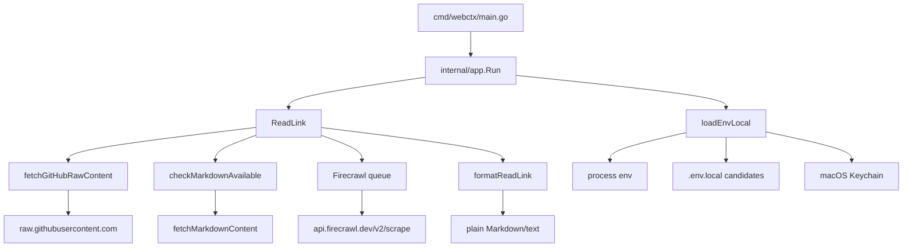

# GitHub-Native `read-link` Sweep

## Coordinates and scope

- **Repository:** `amxv/webctx`
- **Checkout:** `/workspace/repos/webctx`
- **Branch inspected:** `main`
- **Planning baseline:** `4d11f46a39e8ccdbbeccd29c3107e1e801791aff`
- **Date:** 2026-08-14
- **Requested surface:** the existing `webctx read-link <url>` command, with emphasis on `github.com` URLs and the provider/API boundaries that determine what can be read without Firecrawl.
- **Specification basis:** the conversation that requested clean URL-specific GitHub output, plus the Library artifact `existing-repo-feature-planning-workflow(2).md`.
- **Markdown-artifact boundary:** no historical `gg/`, old plans, or adjacent planning Markdown were read. Current source, tests, configuration, Git history, and current user-facing docs were inspected as implementation truth.

This document is a read-only map of the current system and external GitHub capabilities. It does not prescribe the future implementation or phase order.

## Architecture map



The relevant implementation is small and currently concentrated in two files:

- `internal/app/tools.go`: `ReadLink`, Firecrawl request construction, final `formatReadLink`, generic HTTP helpers, and the unrelated search/map providers.
- `internal/app/scrape.go`: GitHub raw-content URL parsing/fetching, direct Markdown detection/fetching, Firecrawl queue primitives, and credential loading.

`internal/app/app.go` is intentionally thin command dispatch. There is no subcommand framework or structured output mode. `read-link` has one positional URL and no read-specific flags.

## Current user-visible behavior

### CLI contract

`internal/app/app.go` recognizes:

```text
webctx search <query> [--exclude domain1,domain2] [--keyword phrase]
webctx read-link <url>
webctx map-site <url>
webctx --version
```

For `read-link`, the first positional argument becomes the input URL. A successful read prints one string to stdout. Errors are printed to stderr with exit code 1.

### Current `read-link` precedence

`ReadLink` in `internal/app/tools.go` executes exactly these paths in order:

1. `fetchGitHubRawContent(rawURL)`;
2. if that returns no result, `checkMarkdownAvailable(rawURL)` and then `fetchMarkdownContent(rawURL)`;
3. if neither fast path succeeds, require `FIRECRAWL_API_KEY` and call Firecrawl `/v2/scrape`.

The Firecrawl request is configured with:

```text
formats: [markdown]
onlyMainContent: true
skipTlsVerification: true
blockAds: true
removeBase64Images: true
maxAge: 600000
excludeTags: script/style/meta/noscript/svg/img/nav/footer/header/aside/ad selectors
```

PDF URLs additionally request the PDF parser.

The final generic formatter emits:

```markdown
# <title>

**URL:** <original URL>

<markdown>
```

There is no GitHub-specific structured metadata, pagination marker, truncation marker, route hint, auth hint, or selector-aware output.

## Current GitHub URL handling

### `githubURLInfo`

`internal/app/scrape.go` currently models GitHub URLs as:

```go
type githubURLInfo struct {
    Owner  string
    Repo   string
    Branch string
    Path   string
    IsFile bool
}
```

`parseGitHubURL` accepts only the exact host `github.com` and requires at least owner/repository path components.

Current recognized shapes are:

| URL shape | Current interpretation |
| --- | --- |
| `/{owner}/{repo}` | repository root, treated as a file-like README request |
| `/{owner}/{repo}/blob/{branch}/{path}` | file |
| `/{owner}/{repo}/tree/{branch}/{path}` | tree, marked `IsFile=false` |
| anything else below a repository | not recognized by the GitHub fast path |

An unrecognized GitHub route therefore continues through direct-`.md` detection and usually Firecrawl.

### Raw conversion

For a repository root, `convertToRawGitHubURL` generates:

```text
https://raw.githubusercontent.com/{owner}/{repo}/HEAD/README.md
```

If `README.md` returns 404, `fetchGitHubRawContent` also tries `readme.md`, `Readme.md`, and `README`.

For a blob, it generates:

```text
https://raw.githubusercontent.com/{owner}/{repo}/{branch}/{path}
```

The code ignores URL query and fragment semantics. A source URL ending in `#L20-L40` therefore returns the full file. A Markdown heading fragment likewise returns the full Markdown file.

Tree URLs are deliberately rejected by the raw-content function and fall through to the general paths.

### Slash-containing refs are a hidden ambiguity

The current parser assigns the first segment after `/blob/` or `/tree/` to `Branch` and everything after that to `Path`. GitHub branch/ref names may contain `/`, so the page path does not contain a syntactic delimiter that uniquely separates ref from file path.

A live probe against `cli/cli` found the branch `andyfeller/test` and URL:

```text
https://github.com/cli/cli/blob/andyfeller/test/README.md
```

The current parser would call the branch `andyfeller` and the path `test/README.md`. The existing raw URL still returned the intended README because `raw.githubusercontent.com` resolved the combined tail successfully. In contrast, GitHub's Contents API returned 200 for `ref=andyfeller/test` and 404 for `ref=andyfeller`.

The present implementation therefore contains an ambiguity that is masked by raw-host behavior but becomes observable for API-backed tree/history/blame reads.

## Current direct-Markdown path

For any URL not handled by the GitHub raw path, `checkMarkdownAvailable` appends `.md` unless already present, makes a HEAD request, and accepts the candidate only when:

- status is 2xx;
- content type contains `markdown` or `text/plain`;
- content length is greater than 50 bytes.

`fetchMarkdownContent` then GETs that URL. This path does not interpret fragments or page semantics either.

The direct-Markdown behavior is not GitHub-specific and is part of the existing fallback chain that current docs promise.

## Current Firecrawl path and queue

Firecrawl is the only structured/rendered-page extraction provider for normal pages and currently handles most GitHub UI URLs, including Issues, Pull Requests, tree pages, Actions pages, releases, profiles, Discussions, and search pages.

`getFirecrawlQueue` creates one process-local singleton with:

- a mutex that serializes queued operations;
- a token bucket starting at 10 tokens;
- one token refilled every six seconds;
- a 90-second queue/acquire timeout;
- a 60-second HTTP request timeout in `ReadLink`.

There is no equivalent GitHub API rate-limit manager because no GitHub API client currently exists.

## HTTP boundary

### Current helpers discard response metadata

`doRawRequest` in `internal/app/tools.go`:

1. creates an `http.Request`;
2. sets caller-provided headers;
3. calls `http.DefaultClient.Do`;
4. reads the full response body into memory;
5. returns only `[]byte` on 2xx;
6. turns non-2xx responses into a generic formatted error.

It does **not** return:

- the HTTP status code as structured data;
- response headers;
- GitHub `Link` pagination headers;
- `X-RateLimit-*` headers;
- `Retry-After`;
- response media type;
- redirect/final URL information.

`fetchText` in `scrape.go` returns body, status integer, and error, but likewise discards headers.

This is sufficient for current one-shot raw/Firecrawl behavior, but the current HTTP abstraction contains no mechanism to represent API pagination or rate-limit state.

### Whole-response materialization

All current HTTP readers use `io.ReadAll`. There is no streaming response abstraction. This matters for future-equivalent large representations such as logs or large raw files, but current source blobs already materialize the entire raw file before output.

## Authentication and secret handling

### Current credential keys

`credentialEnvKeys` is a fixed slice:

```text
BRAVE_API_KEY
TAVILY_API_KEY
EXA_API_KEY
FIRECRAWL_API_KEY
```

There is no GitHub token lookup today.

### Loading order

`Run` calls `loadEnvLocal` before dispatch. Loading proceeds through candidate `.env.local` files and macOS Keychain for keys not already present in the process environment.

Candidate `.env.local` paths are:

1. executable directory;
2. parent of executable directory;
3. current working directory.

Existing process variables win. An explicitly present empty variable also wins because the implementation tests `os.LookupEnv`, not non-empty content. Current tests intentionally assert this behavior.

On macOS, Keychain service is `webctx`, with account name equal to the environment-variable name. There is no credential persistence inside webctx itself.

### Current docs surface

`.env.local.example`, README, `src/content/docs/credentials.md`, `cli-reference.md`, and troubleshooting docs list only the four existing provider keys. GitHub private blob handling is currently documented as unsupported by the unauthenticated raw path.

## Current output and content-loss behavior

The existing raw-file fast path is close to lossless for fetched text: it passes raw response content through `formatReadLink` unchanged apart from adding title/URL framing.

Firecrawl output is provider-produced Markdown. `webctx` does not post-process it to recover GitHub resource identity, distinguish issue comments from UI events, reconstruct review threads, or prove pagination completeness.

The current implementation has no concept of:

- visible versus invisible GitHub Markdown content;
- comments versus timeline events;
- review versus inline review comment;
- resolved versus unresolved review thread;
- file/hunk selectors;
- GitHub list-page filters;
- page-local next/previous navigation;
- provider-declared truncation/caps.

## Current tests and what they prove

`internal/app/app_test.go` contains 11 tests. Relevant GitHub/read-link coverage is limited.

### Proven

- root help/version command behavior;
- missing search argument handling;
- search URL normalization/ranking behavior, including duplicate boost and insertion-order preservation for tied scores;
- one GitHub parser example for `.../blob/main/cli.ts`;
- helpful missing-credential errors for search and map-site;
- `.env.local` precedence;
- executable/cwd `.env.local` candidate order;
- macOS Keychain loader does not override already-present environment variables.

### Not proven

There are no deterministic tests for:

- repository-root README fallback;
- raw file fetch success/failure;
- tree fallthrough;
- fragments or query parameters;
- slash-containing Git refs;
- `ReadLink` fast-path precedence;
- Firecrawl fallback boundary;
- Firecrawl request body from `ReadLink`;
- HTTP status/header preservation;
- pagination;
- GitHub authentication;
- rate-limit errors;
- output size/boundedness;
- Markdown-safe truncation;
- issue/PR/review/timeline semantics;
- large responses;
- injected HTTP failures.

The package does not currently expose an HTTP client/base-URL seam used by tests. Networked helper functions directly use `http.DefaultClient` and production URLs.

### Baseline validation observation

A planning-time `go test ./...` invocation did not complete because the `go test` process entered Linux uninterruptible-I/O (`D`) state on the Zodex host. The process was terminated from the harness after no test output. This is an environment observation, not evidence of a repository test failure. `go vet` and the subsequent npm check in that chained shell did not run because execution never advanced past `go test`.

## Current docs and public contracts in the blast radius

Current product documentation explicitly describes the old three-way read pipeline and therefore becomes stale when GitHub-native behavior changes:

- `README.md`: describes GitHub file/raw fast path and Firecrawl for other pages.
- `src/content/docs/read-link.md`: says repository roots are README requests, tree URLs fall through, and all other pages use Firecrawl.
- `src/content/docs/architecture.md`: assigns GitHub raw parsing to `scrape.go` and lists no GitHub API boundary.
- `src/content/docs/agent-workflows.md`: teaches only repo-root/blob usage.
- `src/content/docs/credentials.md`: has no optional GitHub token.
- `src/content/docs/cli-reference.md`: has no GitHub auth or selector vocabulary.
- `src/content/docs/troubleshooting.md`: says private GitHub blobs require a different workflow.
- `src/content/docs/quickstart.md`: describes Firecrawl as the link-reading provider when Markdown fast paths fail.
- `src/pages/index.astro`: landing-page copy and diagram describe only “GitHub blob -> raw”, “Markdown”, then Firecrawl.

The npm shim, release asset names, CLI command names, and argument grammar are not inherently coupled to a GitHub-native implementation.

## Relevant Git history

The current Go implementation largely arrived in commit `648c88c` (`Port webctx CLI to Go and ready release flow`). That change added `scrape.go`, most of `tools.go`, and the initial Go tests in one porting pass.

Commit `1e0b96d` (`fix: load credentials from binary env and keychain`) added the current credential-loading behavior and tests that protect environment precedence.

Later history is dominated by documentation/site/package maintenance; there is no later GitHub-reader subsystem to preserve or migrate. The planning run also integrated current `origin/main` commit `4d11f46` (`fix: preserve insertion order for tied search results`), which changes only search ranking tie behavior/tests and does not alter `ReadLink`; that search regression is part of the behavior later phases must preserve.

The repository license switched to Apache 2.0 in commit `41542b6`, while `package.json` still says MIT. GitHub's live repository metadata reports `Apache-2.0`. This is an unrelated current inconsistency; it is relevant only because a repository-root metadata renderer would receive provider truth from GitHub rather than package metadata.

## External GitHub provider boundary

The following is factual provider capability research, not a target-design prescription.

### API versioning

GitHub's current REST documentation lists `2026-03-10` as a supported API version. Requests can pin it with:

```text
X-GitHub-Api-Version: 2026-03-10
```

Primary source: https://docs.github.com/en/rest/about-the-rest-api/api-versions

### Public authentication and rate limits

GitHub documents a primary REST rate limit of 60 requests/hour for unauthenticated public requests by originating IP and generally 5,000 requests/hour for authenticated user requests. Rate-limit responses expose headers including limit, remaining count, used count, reset time, and resource; secondary limits can also use `Retry-After`.

Primary source: https://docs.github.com/en/rest/using-the-rest-api/rate-limits-for-the-rest-api

### REST pagination

Many list endpoints default to 30 items and accept up to 100. GitHub communicates pagination links using the HTTP `Link` header and documents following the returned URLs rather than constructing pages from assumptions.

Primary source: https://docs.github.com/en/rest/using-the-rest-api/using-pagination-in-the-rest-api

A live request for `cli/cli` branches with `per_page=100` returned a `Link` header containing both `next` and `last` URLs.

### GraphQL authentication

GitHub's GraphQL API requires authentication. This differs from many REST read endpoints, which can read public resources anonymously.

Primary source: https://docs.github.com/en/graphql/guides/forming-calls-with-graphql

### Provider-level freshness caveat

Some GitHub APIs are not real-time by contract. For example, the Events API documents latency from roughly 30 seconds to hours, and repository statistics endpoints may return cached/computing results. A client can avoid its own caching without making GitHub's provider data intrinsically uncached.

Primary sources:

- https://docs.github.com/en/rest/activity/events
- https://docs.github.com/en/rest/metrics/statistics

## GitHub route/capability inventory

The table records whether a stable first-party data source exists for common read-oriented GitHub URL families. It does not choose whether webctx will implement each one.

| GitHub UI/resource family | First-party structured/raw source observed | Authentication notes / limitations |
| --- | --- | --- |
| repository root | REST repository + README endpoints | public REST works anonymously |
| blob/raw source | `raw.githubusercontent.com`, Contents API | public raw works anonymously; private needs auth-capable path |
| tree/directory | REST Contents / Git Trees | ref/path ambiguity must be resolved |
| source line fragment | raw file plus URL fragment semantics | selector is client-side URL meaning |
| Markdown heading fragment | raw Markdown plus heading semantics | exact GitHub slug edge cases require live compatibility proof |
| commit | REST commits + commit comments | public REST works anonymously |
| compare | REST compare commits | file-list limits must be surfaced |
| path commit history | REST list commits with `path`/`sha` | ref/path resolution matters |
| blame | GraphQL `Blame` / `BlameRange` | GraphQL requires token |
| issue detail | REST issue | public REST works anonymously |
| issue conversation/timeline | REST timeline/comments/events | paginated; public resources anonymous |
| exact issue comment | REST get issue comment | comment IDs map directly |
| sub-issues | REST sub-issues | current API exposes parent/children operations |
| issue dependencies | REST issue dependencies | current API exposes blocking/blocked relationships |
| issue field values/types | REST issue field/type endpoints | current API has structured fields; availability can vary by repo/org features |
| issue lists/filters | REST repository issues / Search API | REST treats PRs as issues, so caller filtering matters |
| labels | REST labels | public REST available |
| milestones | REST milestones | public REST available |
| PR detail | REST pull request | public REST available |
| PR normal comments | issue comments/timeline | PR conversation spans Issue and PR resources |
| PR reviews | REST pull reviews | public REST available |
| PR inline review comments | REST pull review comments | `in_reply_to_id` supports reply relationships |
| PR resolved/outdated review-thread state | GraphQL `PullRequestReviewThread` | GraphQL token required |
| PR files/diffs | REST list files / diff media | GitHub documents a 3,000-file ceiling on list-files |
| PR file/line fragment | URL fragment + returned filename/patch | fragment semantics observed live |
| PR commits | REST PR commits | paginated |
| PR checks | Check Runs + commit status APIs | provider data is split across check/status resources |
| branches | REST branches | public REST available |
| tags | REST tags | public REST available |
| releases | REST releases | release body/assets structured |
| Actions workflows/runs | REST Actions | public resources can be read; permissions vary |
| Actions jobs/steps | REST workflow jobs | job objects include step states and canonical `html_url` |
| Actions job logs | REST job logs download | redirect/archive response behavior must be handled |
| Actions artifacts | REST artifacts | expired/deleted artifacts possible |
| check runs/annotations | REST Checks | annotations are paginated |
| deployments/statuses | REST deployments/statuses | public repositories can be read anonymously; statuses retained 90 days |
| Gists | REST Gists | public Gists anonymous; API can mark large files truncated |
| Discussions | GraphQL Discussions API | token required |
| repository stargazers/watchers/forks | REST activity/repos | GitHub distinguishes stargazers from subscribers/watchers |
| repository contributor/statistics graphs | REST Metrics | some statistics are computed/cached asynchronously |
| repository activity | REST repository activity/events | Events API is explicitly not real-time |
| GitHub search pages | REST Search APIs | separate/tighter search rate limits apply |
| public user profile/tabs | REST users/activity/repos/gists | public data anonymous where endpoint permits |
| public organization profile/tabs | REST orgs/repos/public members | public data anonymous where endpoint permits |
| package pages | REST Packages | many package endpoints require auth/permissions |
| Projects v2 | GraphQL ProjectsV2 | token/permissions required; classic Projects is deprecated |
| Wiki pages | no equivalent content REST/GraphQL API identified in this sweep | Git-backed wiki repository exists for enabled wikis, but no stable URL-to-content API contract was proven |
| repository settings/admin/forms/billing | APIs exist for some administrative data, but these are mutation/admin UI surfaces rather than ordinary read-link content | often auth/permission-dependent |
| security pages | multiple Security REST APIs exist | explicitly excluded from this workstream by user decision |

Primary GitHub documentation families used for the inventory:

- Repositories/contents: https://docs.github.com/en/rest/repos
- Issues: https://docs.github.com/en/rest/issues
- Pull requests: https://docs.github.com/en/rest/pulls
- Commits: https://docs.github.com/en/rest/commits
- Actions: https://docs.github.com/en/rest/actions
- Checks: https://docs.github.com/en/rest/checks
- Releases: https://docs.github.com/en/rest/releases
- Activity: https://docs.github.com/en/rest/activity
- Metrics: https://docs.github.com/en/rest/metrics
- Deployments: https://docs.github.com/en/rest/deployments
- Packages: https://docs.github.com/en/rest/packages
- Search: https://docs.github.com/en/rest/search
- Users: https://docs.github.com/en/rest/users
- Organizations: https://docs.github.com/en/rest/orgs
- Gists: https://docs.github.com/en/rest/gists
- Discussions GraphQL: https://docs.github.com/en/graphql/guides/using-the-graphql-api-for-discussions
- GraphQL pull-request model: https://docs.github.com/en/graphql/reference/objects#pullrequestreviewthread
- GraphQL repository/blame model: https://docs.github.com/en/graphql/reference/objects#blame

## Live URL-semantic probes

### Repository metadata and README

A live anonymous REST request for `amxv/webctx` returned:

```text
full_name: amxv/webctx
description: fast multi-provider web search & full page scrape cli for agents
language: Go
default_branch: main
license: Apache-2.0
stargazers_count: 1
forks_count: 1
open_issues_count: 4
archived: false
fork: false
topics: cli, developer-tools, golang, markdown, scraping, web-search
```

The README endpoint returned `README.md`, size 3,042 bytes, its GitHub blob `html_url`, and raw `download_url`. This proves the provider can supply a canonical full-README URL without guessing the repository's branch or README casing.

### Issue and PR payload cost

Read-only planning probes against public `cli/cli` resources showed why raw API JSON is not itself an agent-friendly output format:

- Issue `cli/cli#13840`: issue body about 1.5k characters, 140 comments with roughly 60k comment-body characters; raw fetched API JSON across the probe was roughly 504k characters. A simple experimental semantic Markdown projection retaining substantive bodies was roughly 71k characters.
- PR `cli/cli#13250`: 3 issue comments, 19 reviews, and 28 inline review comments; raw fetched JSON was roughly 170k characters while a simple semantic projection was roughly 14.5k characters.

These were research probes only; no formatter was added to the repository.

### Issue timeline event shape

Live Issue timeline responses included event kinds such as:

```text
commented
labeled
mentioned
subscribed
cross-referenced
user_blocked
pinned
```

A PR timeline additionally included examples such as:

```text
reviewed
committed
review_requested
review_request_removed
ready_for_review
base_ref_changed
head_ref_force_pushed
renamed
commented
```

The provider therefore mixes substantive conversation with UI/activity events that have very different informational value.

### Exact PR review-comment anchor

REST review-comment objects returned canonical `html_url` values of the form:

```text
https://github.com/cli/cli/pull/13250#discussion_r3118513169
```

The comment ID is encoded directly in the URL fragment.

### PR Files Changed anchors

A live HTML probe of `https://github.com/cli/cli/pull/13250/files` confirmed GitHub's current diff-anchor convention for file paths:

```text
#diff-<sha256(filename)>
```

For `internal/ghcmd/cmd.go`, SHA-256 is:

```text
553490f999984ba28c4af0d7ffa919d10b5419f04a73f00141ee0b5a51c142e6
```

and the page contained that exact `diff-...` anchor. Line anchors were observed with suffixes such as:

```text
L24
R24
```

This behavior was observed from live GitHub UI markup rather than documented as a stable REST contract; it therefore remains a compatibility fact that should be regression-probed when relied upon.

### Actions canonical job URLs

Actions job API objects returned canonical job URLs of the form:

```text
https://github.com/cli/cli/actions/runs/31734097528/job/94561429216
```

The job response includes structured steps with number, name, status, and conclusion. A static HTML probe did not expose a simple server-rendered `#step:` fragment convention, so exact Actions-step fragment semantics were not proven in this sweep.

## GitHub API ceilings and partial-result risks

Several provider limits can turn an apparently successful read into an incomplete result if not represented explicitly:

- Pull Request list-files is documented with a maximum of 3,000 files.
- Commit file listings are paginated and documented with a maximum of 3,000 files for a single commit response series.
- Gist API responses may mark files `truncated`; large files have separate raw URLs.
- Repository Contents directory listings have a 1,000-item upper limit; Git Trees is the documented alternative for larger trees.
- Repository Contents raw/object media supports files from 1–100 MB while Git blob reads are likewise documented up to 100 MB; larger file behavior must not be invented by the client.
- Actions artifacts/logs may expire or redirect to downloadable archives.
- Repository statistics may return 202 while GitHub computes cached statistics.
- Events are explicitly delayed and not a real-time source.
- Search has rate limits distinct from ordinary core REST requests.

A 2xx status alone is therefore not proof of semantic completeness for every resource family.

## Existing patterns worth copying

These are current repository patterns, not target-design choices:

1. **Keep the CLI surface tiny.** `Run` has simple command dispatch and `read-link` needs only a URL.
2. **Prefer cheap direct content before scraping.** The existing raw GitHub and `.md` paths already encode this product principle.
3. **Plain Markdown/text output.** There is no JSON mode to preserve for `read-link`.
4. **Environment + `.env.local` + Keychain credential discovery.** Provider credentials already have a single startup path.
5. **No third-party Go dependencies.** `go.mod` currently has no required modules beyond the standard library.
6. **Current Firecrawl settings are an explicit compatibility contract.** `AGENTS.md` says not to silently change them.
7. **Docs are part of the product.** The current site has dedicated command, architecture, credential, troubleshooting, and agent-workflow pages whose wording tracks behavior.

## Negative findings

1. There is no hidden GitHub API client or reusable structured GitHub model in another package.
2. The existing `githubURLInfo` is too narrow to represent Issues, PR views, fragments, query filters, commits, Actions, or profile/Gist URLs.
3. The current parser's `Branch`/`Path` split is not authoritative for slash-containing refs.
4. The existing generic HTTP helper cannot support header-driven pagination/rate-limit behavior without a richer response seam.
5. Raw API JSON would be dramatically noisier than the human-visible content and is not a viable output substitute by itself.
6. REST does not expose every useful GitHub UI concept. Discussions, blame, and resolved PR review-thread state have important GraphQL-only or GraphQL-stronger paths, and GraphQL requires auth.
7. GitHub's own provider APIs can have delayed/cached data; “always live” at the client cannot mean bypassing provider-side computation/cache.
8. There is no deterministic network fixture seam today; introducing broad live provider behavior without one would make failure/rate-limit tests brittle.
9. The current docs promise tree fallthrough and Firecrawl handling for most GitHub UI pages, so changing implementation without docs would create a public-contract mismatch.
10. Some GitHub UI routes have no stable first-party content API identified in this sweep, notably Wiki page content. Treating undocumented HTML internals as an API would recreate the fragility this workstream is intended to remove.

## Landmines

### Landmine 1 — Ref/path ambiguity

A `/blob/` or `/tree/` URL cannot be split at a fixed segment because Git refs may contain `/`. The current raw-host path masks this defect. API-backed source navigation cannot assume the current parser is authoritative.

### Landmine 2 — Pull Requests are also Issues in REST

GitHub's Issues API includes Pull Requests. A repository `/issues` renderer that maps REST results directly can accidentally mix PRs into an Issues-only page unless it preserves the UI route's semantics.

### Landmine 3 — PR conversation spans multiple resources

A human PR conversation combines issue comments, timeline events, formal reviews, and inline review threads. Fetching only `GET /pulls/{n}` or only the timeline loses substantive information; naively concatenating all endpoints can duplicate the same event/review.

### Landmine 4 — Review-thread truth is split between REST and GraphQL

REST inline comments expose reply relationships, but resolved/outdated thread state is richer in `PullRequestReviewThread`, which requires GraphQL authentication. Anonymous and authenticated reads cannot silently present incompatible notions of thread state.

### Landmine 5 — Fragments carry semantic intent

GitHub fragments such as `#L20-L40`, `#issuecomment-*`, `#discussion_r*`, review anchors, and Files Changed diff anchors materially narrow what a human intends to read. Dropping `url.Fragment`, as the current behavior effectively does, causes avoidable context expansion.

### Landmine 6 — Diff anchors are observed UI behavior, not a documented REST contract

`#diff-<sha256(path)>` and line suffixes were verified live but are not an API schema. A native reader may rely on them only with explicit parser tests and live compatibility evidence.

### Landmine 7 — Successful API responses can still be partial

PR/commit file ceilings, Gist truncation, pagination, expired logs/artifacts, and statistics computation mean “HTTP 200” is not equivalent to “complete representation.”

### Landmine 8 — Header loss blocks truthful pagination and rate-limit UX

The existing HTTP helpers erase exactly the metadata GitHub uses for `Link`, rate-limit reset, retry, and media-type behavior.

### Landmine 9 — Auth must remain optional without becoming invisible

Public REST works without a token, while GraphQL and private resources do not. The same GitHub URL can therefore have different available provider facts. Missing auth needs to be distinguishable from nonexistent content without nagging successful anonymous reads.

### Landmine 10 — 404 can mean absent or private

GitHub intentionally uses not-found responses for resources the caller cannot see. Without a token, a recognized private resource cannot always be distinguished from an actually absent resource.

### Landmine 11 — Hidden HTML comments differ by resource type

Issue/PR/comment bodies returned by APIs may contain invisible HTML automation markers that a human browsing GitHub does not see. Source Markdown blobs may contain the same syntax as intentional source content. A global “strip HTML comments” rule would corrupt source reads.

### Landmine 12 — Large content has different semantics by URL family

A repository landing page and a direct blob URL do not imply the same user intent. Applying one global output-size cap would either poison context on landing pages or make direct file reads unexpectedly incomplete.

### Landmine 13 — Provider freshness is not entirely client-controlled

“No caching” can prohibit webctx persistence/reuse, but GitHub Events/Statistics can still be delayed or provider-cached. Product wording must not promise stronger freshness than the upstream API guarantees.

### Landmine 14 — Search uses a different rate-limit resource

A generalized GitHub Search reader can exhaust a tighter search quota while ordinary REST remains healthy. Rate-limit reporting must use the response's actual resource/reset data rather than one global counter.

### Landmine 15 — Current tests cannot safely induce provider failures

Direct use of `http.DefaultClient` and fixed production URLs makes 403/404/429/pagination/GraphQL failures difficult to test deterministically without either live mutation or an injection seam.

### Landmine 16 — GitHub-native routing must not consume generic GitHub pages it cannot faithfully represent

If a broad hostname check claims every `github.com` URL before the existing fallback chain, unsupported routes can regress from Firecrawl output to empty/incorrect native output. Recognition and successful native support are different states.

### Landmine 17 — User/org ambiguity is real

A one-segment `github.com/<name>` route can identify a user or organization. The UI path alone does not encode which. Provider lookup/type data must settle it rather than route-string heuristics.

### Landmine 18 — `watchers` naming is deceptive

GitHub's REST documentation states `watchers`/`watchers_count` are historical aliases for star count, while `subscribers_count` is the actual watcher/subscriber count. A compact metadata renderer can easily label the wrong number if field names are taken literally.

### Landmine 19 — Actions logs are a download flow, not ordinary JSON

Job/workflow log endpoints can redirect to downloadable archives. They require a different response-body treatment from ordinary JSON API calls and can be large.

### Landmine 20 — Repository docs currently describe an architecture that this workstream will supersede

Landing-page diagrams, credentials, troubleshooting, and architecture docs will become actively misleading if product changes land without synchronized public documentation.

## Coverage statement

Mapped deeply:

- the complete current `read-link` call path;
- current GitHub raw parser/fetch behavior;
- direct Markdown and Firecrawl fallbacks;
- HTTP helper and credential-loading seams;
- current test coverage and gaps;
- current user-facing docs in the behavior blast radius;
- GitHub REST/GraphQL capability boundaries relevant to read-oriented URLs;
- live ref ambiguity, repository metadata/README, issue/PR event shapes, PR comment anchors, PR Files Changed anchors, and Actions job URL shapes;
- provider pagination, auth, rate-limit, and known completeness ceilings.

Checked at the seam rather than exhaustively:

- search/ranking and `map-site`, which share HTTP/credential helpers but are not themselves being redesigned;
- npm packaging/release wiring, which should remain behaviorally unchanged unless implementation moves files in a way that affects packaged source;
- long-tail GitHub activity/metrics/deployment/package/project APIs, enough to establish first-party data availability but not every field.

Deliberately out of scope for this sweep:

- GitHub security UI/API surfaces, by explicit user decision;
- authenticated mutation/admin/settings/billing behavior;
- historical planning artifacts;
- private live GitHub data because no token was provided for planning.

Factual gaps requiring later live proof:

1. exact GitHub Markdown heading-anchor compatibility for duplicate, punctuation-heavy, Unicode, and generated headings;
2. stable interpretation of Actions step fragments, which was not visible in the static server response probed;
3. exact UI route shapes for some long-tail analytics, deployment, package, and Projects v2 pages across current GitHub UI variants;
4. private-repository and GraphQL behavior with `GH_TOKEN`/`GITHUB_TOKEN`, because no token was available in the planning environment;
5. whether every desired PR check-page UI state can be reconstructed without an auth-only GraphQL field; REST check runs/statuses themselves are available.

These gaps can be tested without weakening the requested outcome: unsupported or auth-required cases can remain truthful rather than silently presenting incomplete data.
